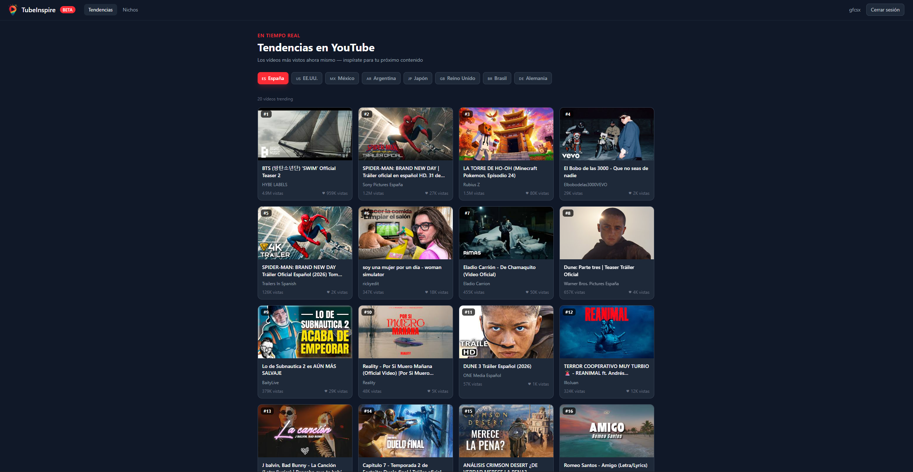
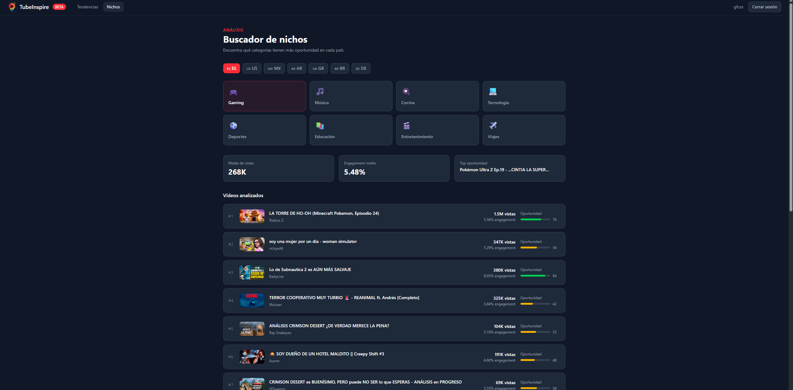

# TubeInspire

Herramienta para creadores de contenido que quieren encontrar ideas, analizar tendencias y descubrir nichos rentables en YouTube.

   

---

## Capturas




---

## Funcionalidades

- **Tendencias en tiempo real** — Los 20 vídeos más vistos en YouTube por país
- **Selector de país** — España, EE.UU., México, Argentina, Japón, Reino Unido, Brasil y Alemania
- **Buscador de nichos** — Análisis de categorías con score de oportunidad y métricas de engagement
- **Autenticación completa** — Registro, login y rutas protegidas con JWT
- **Diseño dark mode** — Interfaz moderna estilo SaaS

---

## Stack tecnológico

**Frontend**
- React 19
- Vite
- Tailwind CSS
- React Router DOM
- Axios

**Backend**
- Node.js
- Express 5
- JSON Web Tokens (JWT)
- bcryptjs

**Base de datos**
- PostgreSQL (Supabase)

**APIs externas**
- YouTube Data API v3

---

## Instalación y uso local

### Requisitos previos

- Node.js v18 o superior
- Cuenta en [Supabase](https://supabase.com) (gratuita)
- API Key de [YouTube Data API v3](https://console.cloud.google.com)

### 1. Clona el repositorio

```bash
git clone https://github.com/pelayoespinosa/tubeinspire.git
cd tubeinspire
```

### 2. Configura el backend

```bash
cd backend
npm install
```

Crea el archivo `.env` basándote en `.env.example`:

```env
PORT=3001
NODE_ENV=development
YOUTUBE_API_KEY=tu_clave_de_youtube
SUPABASE_URL=https://tu_proyecto.supabase.co
SUPABASE_KEY=tu_clave_de_supabase
JWT_SECRET=tu_secreto_jwt
```

Crea la tabla `users` en Supabase con estas columnas:

| Columna | Tipo |
|---|---|
| id | int8 (PK) |
| name | text |
| email | text (unique) |
| password | text |
| created_at | timestamptz |

Arranca el servidor:

```bash
npm run dev
```

El backend estará disponible en `http://localhost:3001`

### 3. Configura el frontend

```bash
cd ../frontend
npm install
npm run dev
```

La app estará disponible en `http://localhost:5173`

---

## Estructura del proyecto

```
tubeinspire/
├── backend/
│   └── src/
│       ├── controllers/    # Lógica de cada endpoint
│       ├── routes/         # Definición de rutas
│       ├── services/       # Conexión con APIs y base de datos
│       └── middleware/     # Autenticación JWT
├── frontend/
│   └── src/
│       ├── components/     # Navbar, VideoCard, CountrySelector
│       ├── pages/          # Home, Niches, Login, Register
│       └── services/       # Llamadas al backend
└── docs/
```

---

## Endpoints de la API

| Método | Ruta | Descripción | Auth |
|---|---|---|---|
| POST | `/api/auth/register` | Registro de usuario | No |
| POST | `/api/auth/login` | Login de usuario | No |
| GET | `/api/trends?country=ES` | Vídeos trending por país | Sí |
| GET | `/api/niches?category=gaming&country=ES` | Análisis de nicho | Sí |
| GET | `/api/health` | Estado del servidor | No |

---

## Autor

**Pelayo Espinosa**  
[GitHub](https://github.com/pelayoespinosa)

---

## Licencia

MIT
